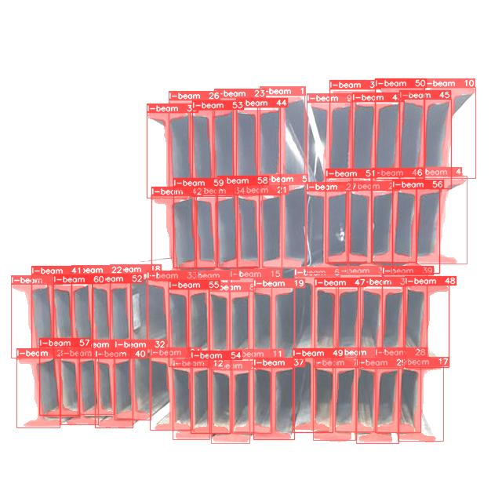
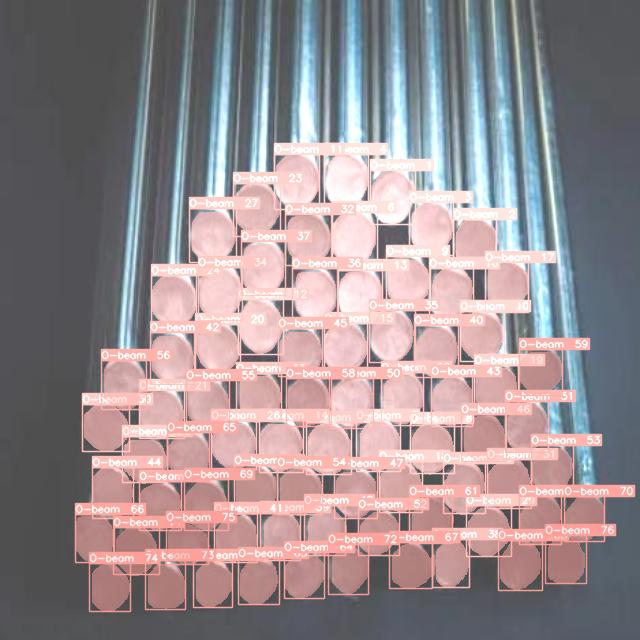

# Steel-Beam-Counting-YOLOv8
Count three types of steel beams (I-beam, T-beam and O-beam) with YOLOv8 model.

## install the dependencies
```bash
pip install -r requirements.txt
```
## run the code
```bash
python object_detection.py
```
## result




## train new models
### 1. create your own dataset with Roboflow
https://roboflow.com/annotate

### 2. train yolov8 segmentation model
https://colab.research.google.com/drive/1183fmdMzcXdVJWHzgj_UHO-EXR4-XElX?usp=share_link

### 3. optimize the model with OpenVINO
https://colab.research.google.com/drive/1RubwhwbNFimsKSoRapgU6PzlbDNFgMF0?usp=share_link

### 4. replace the model in models directory

### 5. run object_detection.py with your path
```
usage: object_detection.py [-h] [--inputdir INPUTDIR] [--outputdir OUTPUTDIR] [--modeldir MODELDIR] [--conf_threshold CONF_THRESHOLD]

InputPath - OutputPath - ModelPath - Confidence

options:
  -h, --help            show this help message and exit
  --inputdir INPUTDIR   The path to input images folder.
  --outputdir OUTPUTDIR
                        The path to output images folder.
  --modeldir MODELDIR   The path to models folder.
  --conf_threshold CONF_THRESHOLD
                        The lowest confidence of result.
```
